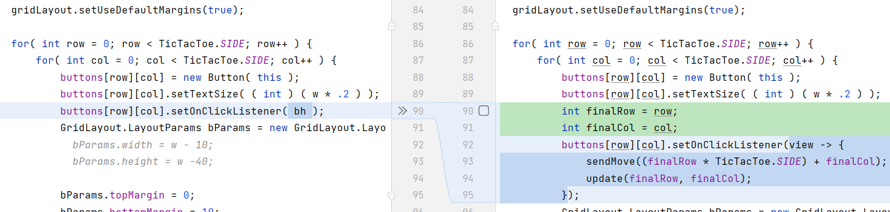

# Milestone 2 Report

## (1) Working System
The system should behave in similar way to the video given with the milestone document.
See: [Milestone 2 Working System.mp4](Milestone%202%20Working%20System.mp4)

## (2) Attribute `turn` and `player` of the `TicTacToe` class

### How the game uses the attribute `turn` and `player`  to manage the game state between the two distributed game boards?

- The two distributed boards both keep track of `turn` and `player`
- At every point in the game, `turn` attribute is the **same** in both board
- The `turn` attribute keeps changing from `1` to `2` and vice versa anytime a move is made
- The `player` attribute is `1` in one board and  `2` in the other board
- From the start to the end of a TicTacToe game, `player` attribute **does not change**
- At each board, if `turn`**=**`player`, then it's the turn of the owner of the board. Therefore, he/she can make a move.
- At each board, if `turn`**≠**`player`, then it's **NOT** the turn of the owner of the board. Therefore, he/she can **NOT** make a move.

### Can we still achieve the same thing without introducing player attributes in this milestone? Why?
#### Case `No`:
If the game is to remain distributed between the two devices, then **we cannot achieve** the same functionality without introducing `player` attribute.
This is because:
- There is no way to know who should start first
- The function `TicTacToe.result()` has no way of knowing if the current user won or lost the game

#### Case `Yes`:
One way to make it work without introducing `player` attribute is to move `TicTacToe` to the server.
Instead of keeping the game board in the two devices, the server will store and manage the entire game board.
The server can then use the user's `username` instead of `player`.

## (3) Deleting game move after responding with `GamingResponse`

### Is this necessary?

In this case, **it is necessary** because:
- The same user can request another `REQUEST_MOVE` and the server will respond to the same move that has already been added to the board.
- Remember `REQUEST_MOVE` is send from a repetitive `timer` that keeps running irrespective of whether the previous call has been processed or not (`GamingResponse` is handled on a different thread).

It might **NOT be necessary** if:
- We check a move before adding it to the game board to avoid repeating moves.

### Pros of deleting?
- Prevents sending a move multiple times
- In this case, a game `move` does not take a huge memory (size of an `Integer` or less).
It cases the data takes some significant memory, deleting the data can free a lot of memory.

### Cons of deleting?
- If a network error occurs while sending `GamingResponse` to the client, then the game move is lost forever. The players will be left in deadlock.
- In this case, a game `move` does not take a huge memory (size of an `Integer` or less). 
It cases the data takes some significant memory, not deleting the data can accumulate a huge memory.

## (4) `ButtonHandler` inner class in `MainActivity`
### Can you think of a way to not loop through all the buttons?

We can use an `Anonymous Inner class` and effective final attribute of `row` & `col` instead of defining the inner class `ButtonHandler`

### Implementation
See the code changes below:

